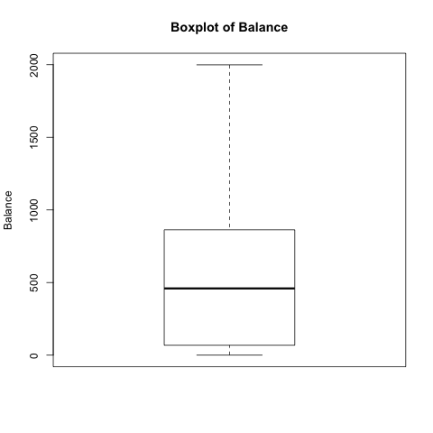
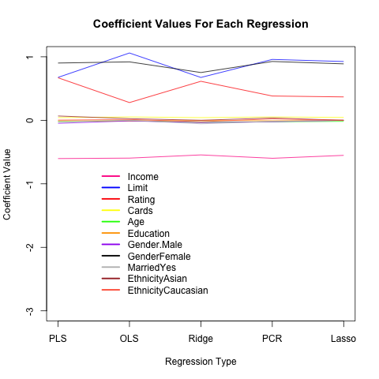

## Introduction
Our intention for this project is to evaluate the predictive power of the following five regressions: Least-Squares regression, Ridge regression, Lasso regression, Principal Component regression, and Partial Least-Squares regression.  

We will be using a dataset where the response variable is an individual's credit card balance and the explanatory variables are an individual's characteristics (gender, income, age, etc.).

## Exploratory Data Analysis
Before we ran any sort of regression on the dataset, we first engaged in some exploratory data analysis by making histograms, boxplots, and summary statistics for the variables in our dataset. Here's a boxplot of our Balance variable, which is our response variable.




## Preparing our Data for Regression Analysis
In order for us to be able to run our regressions, we first need to modify the data so it's suitable for regression analysis. We manipulated our data in the following ways:  
  
1. Converted columns of categorical variables into numerical binary columns  
  
2. Centered and standardized the dataset  
  
3. Divided the data into training and test sets

Now, we're ready to run our regressions on our dataset. 

##Methodology (Part 1)
After dividing our data into training and test sets, we're now ready to run our regressions. These are the five regressions that we will be analyzing for this project:  
  
  
1. Least Squares Regression  
2. Ridge Regression  
3. Lasso Regression  
4. Partial Least Squares Regression  
5. Principal Component Regression  

##Methodology (Part 2) 
Lets go through a quick theoretical overview for each regression method.  
  
Least Squares: solution is unbiased, but has high variance  
  
Ridge: solution minimizes both residuals and squared norm of beta vector  
  
Lasso: solution minimizes both residuals and absolute norm of beta vector  

PCA: solution is a result of running a regression on linear combinations of explanatory variable columns  
  
PLSR: similar to PCA, but its linear combinations of explanatory variables take into account the strength of each explanatory variable's relationship with the response variable. 


##Regression Coefficients
Lets take a look at how our regression coefficients differed for each regression type. The plot below demonstrates how the regression coefficients change for each regression type: 
<div class="centered">
 
</div>
While informative, this coefficient plot doesn't tell us about the predictive performance of our regressions. In the next slide, I'll go over how well/poorly our regressions did from a prediction standpoint.  

##Regression Prediction Performance

```{r results='asis', echo=FALSE}
  library(xtable)
  load(file="../data/mse_table.RData")
  x=xtable(mse)
  print(x, type="html", comment=F)
```
  
  
As one can see, partial least squares regression performed the best, and its average squared error was a mere .14. Ridge regression, meanwhile, had the highest average squared error with .17.

##Conclusion 

From the regressions that 

